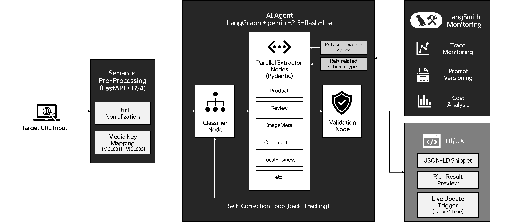

---

# 🔍 검메추해
Beauty SEO Schema Markup AI Agent

> **"뷰티 업계에 화려한 UI에 가려진 데이터를 검색 엔진 언어로 통역합니다."**<br>
> LangGraph를 활용한 이커머스 특화 지능형 SEO 스키마 자동 생성 엔진

---
<br>

## 📖 프로젝트 개요


- 현대의 뷰티 이커머스는 사용자 경험(UX)을 위해 복잡한 스크립트와 미디어 중심의 UI를 채택하지만, 정작 검색 엔진 봇이 페이지의 비즈니스 맥락을 파악하는 데는 한계가 있습니다. 
- **'검메추해'** 는 페이지의 시각적 구조를 의미론적 구조(Structured Data)로 변환하여 검색 엔진 노출(Rich Results)을 높이려는 데 목적을 두고 있습니다.

  
<br>

## ✨ 주요 기능

### 1. 8종 스키마 자동 생성

* **지원 유형:** Product, Organization, Review, Breadcrumb, Article, ImageMeta, LocalBusiness, Video
* `Classifier` 노드가 페이지를 분석하여 최적의 스키마 조합을 자동으로 선택합니다.

### 2. 하이퍼 토큰 최적화 (Semantic Normalization)

* 긴 미디어 URL을 `[IMG_001]` 형태의 키값으로 치환하여 토큰 소모량을 **60% 이상 절감**하고 URL 환각(Hallucination)을 줄입니다.
* SEO와 무관한 스타일 및 스크립트 태그를 제거하여 깔끔한 컨텍스트를 구성합니다.

### 3. 자가 교정형 검증 시스템 (Self-Correction Loop)

* Pydantic v2 가드레일을 통해 Google 가이드라인 위반 시 에이전트가 스스로 수정 루프(Backtracking)를 수행하여 높은 정확도를 지향합니다.

### 4. 실시간 라이브 감지 및 알림 (Live Alert)

* 라이브 커머스 등의 가변적 상태 정보를 포착하며, 최신 정보 유지를 위한 즉각적인 업데이트 액션을 운영자에게 제안합니다.
<br>

---

## 🏗 시스템 아키텍처

에이전트는 **LangGraph** 기반의 상태 중심(Stateful) 워크플로우로 동작합니다.

1. **Input:** 사용자가 타겟 URL 입력
2. **Pre-process:** HTML 정규화 및 `media_map` 생성
3. **Classify:** 대상 페이지에 적합한 스키마 유형 선별
4. **Extract:** 각 스키마 전문가 노드에서 병렬로 JSON-LD 생성
5. **Validate:** 구글 권장사항 준수 여부 체크 및 실패 시 수정 재시도
6. **Output:** 최종 JSON-LD 및 실시간 방송 알림 제공
<br>


---

## 🛠 기술 스택

* **LLM:** Google Gemini 2.5 Flash-lite
* **Framework:** FastAPI, LangChain, LangGraph
* **Validation:** Pydantic v2 (Strict Type Guard)
* **Monitoring:** LangSmith (Trace Monitoring & Prompt Optimization)
* **Knowledge:** Google Search Central Docs, Schema.org
<br>


---

## 📊 실행 사례

### Breadcrumb 추출 사례

* **Input URL:** `https://www.amoremall.com/kr/ko/cs/noticeView/7022`
* **Trace Speed:** **1.46s** (Gemini-2.5-flash-lite 기준)
* **Output**
```
{
  "@context": "https://schema.org/",
  "@type": "BreadcrumbList",
  "itemListElement": [
    {
      "@context": "https://schema.org/",
      "@type": "ListItem",
      "position": 1,
      "name": "아모레퍼시픽 공식몰",
      "item": "/kr/ko/"
    },
    {
      "@context": "https://schema.org/",
      "@type": "ListItem",
      "position": 2,
      "name": "공지사항",
      "item": "/kr/ko/cs/notice"
    },
    {
      "@context": "https://schema.org/",
      "@type": "ListItem",
      "position": 3,
      "name": "네이버페이 1월 은행/증권사 시스템 점검 일정 안내",
      "item": "/kr/ko/cs/noticeView/6499"
    }
  ]
}
```
<br>

---

## 📈 Monitoring with LangSmith

에이전트의 모든 추론 과정은 **LangSmith**를 통해 투명하게 관리됩니다.

---
<br>
<br>

